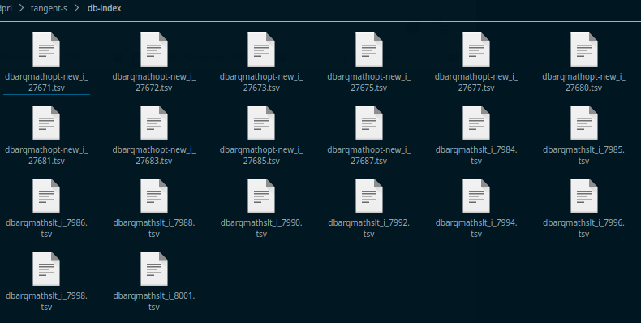
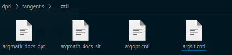
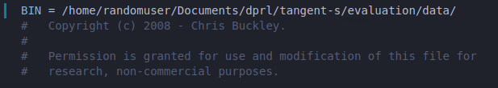
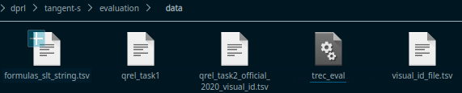
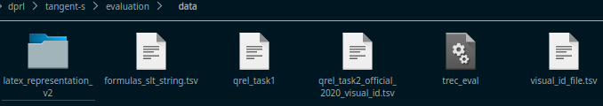
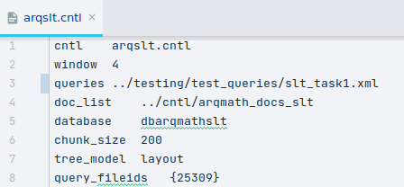
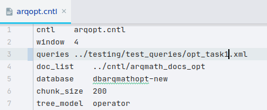
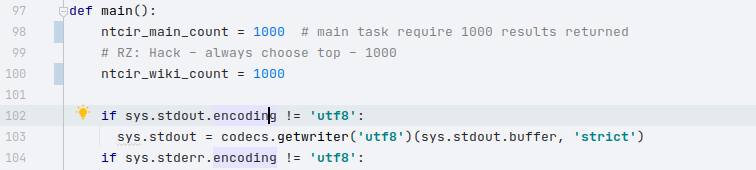
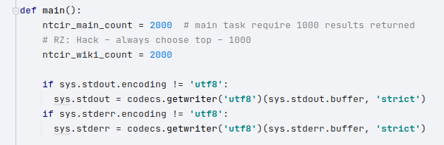

This Readme is supplemental to the main readme. If things are unclear consider reading the main readme first

# Table of Contents
1. [Download Files and Installation](#Download-Files-and-Installation)
   1. [Indices](#indices)
   2. [Control and Doclist Files](#control-and-doclist-files)
   4. [Trec Eval Tool](#trec-eval-tool)
   5. [LaTex Representation](#latex-representation)
2. [Run It](#run-it)
   1. [Task 1](#task-1)
   2. [Task 2](#task-2)

3. [Evaluation](#evaluation)
   1. [Task 1](#task-1)
   2. [Task 2](#task-2)

## Download Files and Installation
### Indices 
Download the zip file here.  
https://drive.google.com/drive/folders/1Qbrl7OpoMUpvJ-TJ65tNz3FRjVIV6CX4  
After extracting the files move all index files to the `tangent-s/db-index` folder  

### Control and Doclist Files
Move the doclist files and control files to the `tangent-s/cntl` folder   

### Trec Eval Tool
Download trec eval tool shown here, outside the tangent-s directory.  
https://github.com/usnistgov/trec_eval  
Navigate the directory it is downloaded in and edit the Makefile so that the first
line BIN variable points to the `tangent-s/evaluation/data/` folder as such  
  
Run `make install` and ensure a `trec_eval` executable populated in the `tangent-s/evaluation/data/` folder  
   
### LaTex Representation
Download the latex_representation_v2.zip from https://drive.google.com/drive/folders/18bHlAWkhIJkLeS9CHvBQQ-BLSn4rrlvE   
extract the repo to `tangent-s/evaluation/data/`

## Run It
Many of the finer details of running the core tangent-s system are highlighted
### Task 1
Within the arqslt.cntl and arqopt.cntl files set the paths to queries argument`../testing/test_queries/slt_task1.xml` and `../testing/test_queries/opt_task1.xml`
respectively  

  
Set the top-k retrieval parameter to 1000 by opening the `src/python/index_query/query.py` file and changing the first two 
variables in the main method as such   
   
At this point navigate to `bin` directory and run `./arqmath-all` as specified in the main readme.
### Task 2
Similarly to task 1 change the query paths to `../testing/test_queries/slt_task2.xml` and
`../testing/test_queries/opt_task2.xml` respectively.
Set the top-k retrieval parameter to 2000 by opening the `src/python/index_query/query.py` file and changing the first two 
variables in the main method as such   
   
At this point navigate to `bin` directory and run `./arqmath-all` as specified in the main readme.
## Evaluation 
### Task1
After running the `./arqmath-all` script run `./arqmath-eval-task-1`. The metrics should then be output in the terminal.
### Task2
After running the `./arqmath-all` script run `./arqmath-eval-task-2`. The metrics should then be output in the terminal.
### Evaluation scripts
To understand the scripts referenced in `./arqmath-eval-task-1` and `./arqmath-eval-task-2`
it is best to just open the files and see how they are used. 